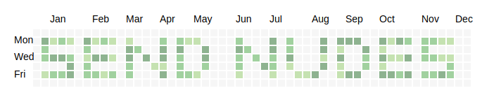

### Hi there from 🇬🇷 👋
#### My name is Tassos,

<a href="https://www.linkedin.com/in/tasos-karageorgiadis-ece/" rel="noopener noreferrer" target="_blank">
  
</a>

<a href="https://twitter.com/k_tassos13" rel="noopener noreferrer" target="_blank">
  
</a>


<a href="https://stackoverflow.com/users/9870435/tassosk" rel="noopener noreferrer" target="_blank">
  
</a>
<!--Icons made by <a href="https://www.flaticon.com/free-icon/browser_634060" title="prettycons">prettycons</a> from <a href="https://www.flaticon.com/" title="Flaticon"> www.flaticon.com</a> -->

<a href="https://tassosblackg.github.io/" title="Website" rel="noopener noreferrer" target="_blank">
  
  
</a>


<a href="https://www.buymeacoffee.com/tassosblackg" target="_blank"></a>


<br />
<br />


----------------------------------------------------------------------------------------------------------------------------------------------------
<br />

 
 <p align="center"><em> <b> "There is always a hidden ace 🂡 underneath!" </b></em></p>
  
  
<br />

----------------------------------------------------------------------------------------------------------------------------------------------------


## Personal sum :radioactive::
- 🔭 I’m currently busy with my <b>MSc</b> on <em>Artificial Intelligence & Data Analytics</em>.
- 🌱 I’m currently envolving 📈 [Check My Statistics](#my-stats).
- 🤔 I’m looking for help with get shit done.
- 📫 How to reach me: soylis.k@gmail.com
- :atom_symbol: Favorite editor :  

[comment]: <- ⚡ Fun fact: My secret mission is to achieve this commit history,>


[comment]: <>


[comment]: <I guess, all I have to do is being consistent:zany_face:! (or not [Check This Out](https://github.com/gokhankuyucak/fakehistory) )>

## Techologies:
<p>
  
  
  
  
  
  
  
  
  
  
  
  
  
  
  
 </p>

# My Stats:
<details title="Expand to see stats">
  
  <summary> Expand to see stats </summary>
<p align="left"> 
  
<p aling="right">

📈 ***Dev Stats per Week***
<br />

<!--START_SECTION:waka-->

```text
Other    10 hrs 28 mins  ███████████████████████░░   92.34 %
```

<!--END_SECTION:waka-->
<br />

</details>


## :anger: My Moto:

***"Think by :heartbeat:, Work by :muscle:! "***  

